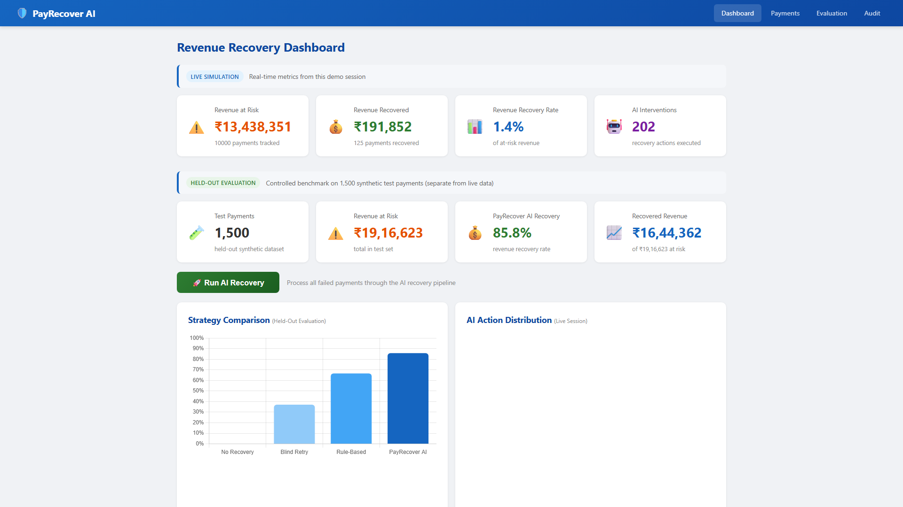
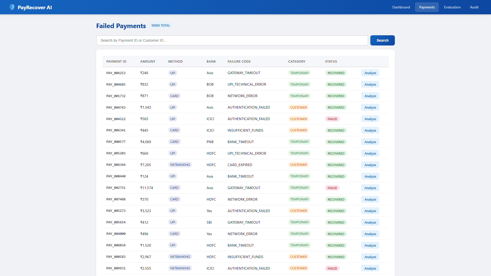
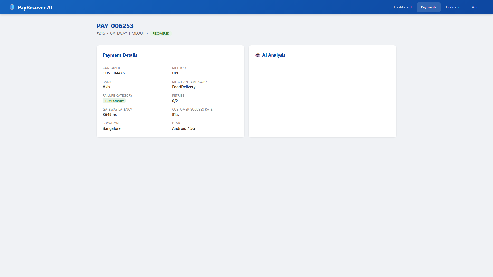
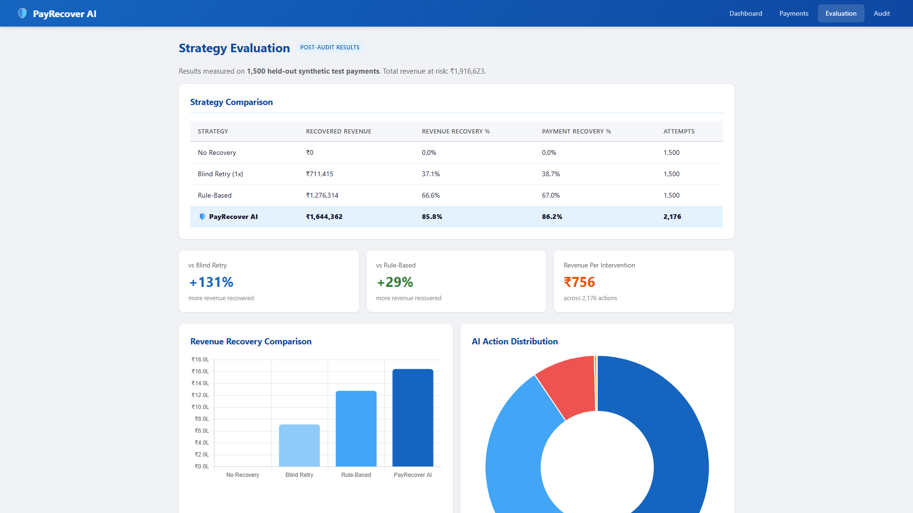
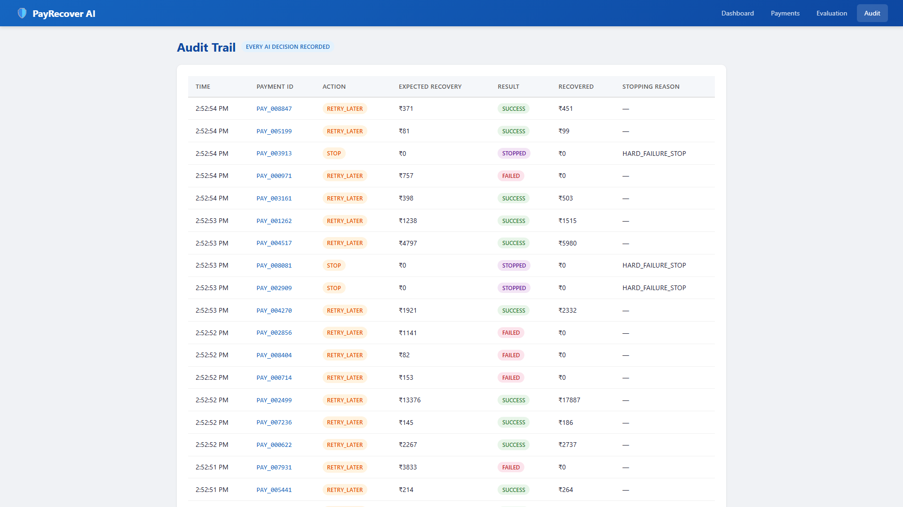

# PayRecover AI

**AI-Powered Payment Recovery & Revenue Protection Agent**  
Built for Razorpay Buildathon — Track 03: Revenue Recovery AI Agent

## One-line pitch

> PayRecover AI detects at-risk payments, diagnoses why revenue is slipping, selects and executes the highest-value bounded intervention, and measures the money actually recovered.

## 🎥 Demo Video

[▶️ Watch the PayRecover AI Demo](https://youtu.be/TRCl89A9jtI)


## What it does

- **Detects revenue at risk** from failed payment events
- **Diagnoses failure type** using ML (temporary / customer-related / hard failure)
- **Predicts recovery probability** for each candidate action
- **Chooses the best intervention** using expected recovery value
- **Executes a simulated recovery workflow** with stopping rules
- **Maintains a full audit trail** of every decision and outcome
- **Measures actual recovered revenue** on held-out test data

## Architecture

```
┌─────────────────────────────────────────────────────────┐
│                    Browser (Thymeleaf)                  │
└─────────────────────────┬───────────────────────────────┘
                          │
                          ▼
┌─────────────────────────────────────────────────────────┐
│               Spring Boot Backend :8080                 │
│  ┌──────────┐ ┌──────────┐ ┌──────────┐ ┌──────────┐  │
│  │ Recovery │ │Payment   │ │Dashboard │ │ Audit    │  │
│  │ Agent    │ │Service   │ │Service   │ │ Trail    │  │
│  └────┬─────┘ └──────────┘ └──────────┘ └──────────┘  │
│       │                                                 │
│       ▼                                                 │
│  ┌──────────┐ ┌──────────────────────────────────────┐ │
│  │ H2/MySQL │ │ FastAPI AI Engine :8001              │ │
│  └──────────┘ │  ┌─────────────┐ ┌────────────────┐  │ │
│               │  │ Diagnosis   │ │ Recovery       │  │ │
│               │  │ Model (RF)  │ │ Model (GBM)    │  │ │
│               │  └─────────────┘ └────────────────┘  │ │
│               └──────────────────────────────────────┘ │
└─────────────────────────────────────────────────────────┘
```

## Screenshots

### Dashboard


### Payments List


### Payment Detail + AI Analysis


### Evaluation Page


### Audit Trail


---

## Tech Stack

- **AI Engine:** Python 3.11, scikit-learn 1.4, XGBoost 2.0, pandas, FastAPI
- **Backend:** Java 21, Spring Boot 3.3.5, Spring Data JPA, Thymeleaf
- **Database:** H2 (dev) / MySQL 8 (production)
- **Frontend:** Thymeleaf + Chart.js
- **Infrastructure:** Docker, docker-compose
- **Monitoring:** Spring Boot Actuator (`/actuator/health`), FastAPI `/health`

---

## Live Simulation vs Held-Out Evaluation

The dashboard shows two distinct data contexts:

### Live Simulation (Dashboard)

Real-time metrics from the current demo session. These update as you interact with the system — run batch recovery, analyze payments, execute recovery actions. The numbers reflect what has happened **in this session**.

### Held-Out Evaluation (Evaluation page)

Controlled benchmark results on **1,500 synthetic test payments** that were never used for training. These are fixed, reproducible, and independent of any live demo activity. This is the apples-to-apples comparison of four strategies on the same test set.

**Why this distinction matters:** Live session metrics will differ from evaluation metrics because they operate on different payment subsets and different numbers of recoveries. The evaluation page is the authoritative source for comparing strategy effectiveness.

---

## Experimental Results (Held-Out Test Set)

These are **actual measured results** from running the AI engine on 1,500 held-out synthetic payment events. Every number was produced by executing the code; none were hand-entered.

### Strategy Comparison

| Strategy | Recovered Revenue | Revenue Recovery % | Payment Recovery % | Attempts |
|----------|------------------:|-------------------:|-------------------:|---------:|
| No Recovery | ₹0 | 0.0% | 0.0% | 1,500 |
| Blind Retry (1x) | ₹711,415 | 37.1% | 38.7% | 1,500 |
| Rule-Based | ₹1,276,314 | 66.6% | 67.0% | 1,500 |
| **PayRecover AI** | **₹1,644,362** | **85.8%** | **86.2%** | **2,176** |

- **Test set:** 1,500 failed payments  
- **Total revenue at risk:** ₹1,916,623  
- **PayRecover AI recovered:** ₹1,644,362  
- **Improvement over blind retry:** +131% more revenue recovered  
- **Improvement over rule-based:** +29% more revenue recovered  
- **Revenue per intervention:** ₹755.68
- **Revenue at risk (actual):** ₹1,916,623  

### ML Model Performance

**Failure Diagnosis Model (Random Forest)**  
- Validation F1 (macro): 0.9971  
- Interpretation: High accuracy is expected because `failure_category` is a deterministic function of `failure_code` in the synthetic dataset. The model learns this mapping, which is a legitimate use of available information.

**Recovery Probability Model (Gradient Boosting Regressor)**  
- Validation R²: 0.9998  
- Interpretation: Ground truth is a deterministic function of `(failure_code, action, customer_success_rate)` — a lookup table plus linear adjustment. Gradient boosting learns this exactly. No data leakage; all features are available at inference time.

### AI Action Distribution

| Action | Count | Avg. Revenue/Action |
|--------|------:|--------------------:|
| SEND_NOTIFICATION | 988 | ₹755 |
| RETRY_LATER | 965 | ₹755 |
| STOP | 207 | — |
| SWITCH_METHOD | 16 | ₹755 |

### Stopping Reasons

| Reason | Count |
|--------|------:|
| MAX_RETRIES_REACHED | 204 |
| NO_POSITIVE_EV | 3 |

### Cost Efficiency

- **2,176 total AI interventions** vs 1,500 naive interventions
- **676 additional interventions** produced ₹368,048 more revenue than rule-based
- **Incremental revenue per extra intervention:** ₹544
- **Net ROI:** 29% more revenue recovered than rule-based with only 45% more interventions

---

## AI Validity Audit

We audited the full ML pipeline for data leakage and methodological issues. Summary:

### ✅ No data leakage found

- `failure_code` (used as a feature) is available in production; it simply identifies the error type.
- Recovery model features (`failure_code`, `action`, `customer_success_rate`) are all available at inference time.
- Train/val/test split is performed before any training. The test set is never used for model selection or tuning.

### ✅ High metrics are expected for synthetic data

- The diagnosis model achieves 0.9971 F1 because it learns a deterministic mapping from `failure_code` → `failure_category`.
- The recovery model achieves 0.9998 R² because the ground truth is a simple lookup + linear function.
- These metrics would be lower with real-world noisy data, but the approach would still provide useful signal.

### ✅ Bug fixed (v1.1)

- **Issue:** The recovery model was receiving the *true* `failure_category` from the dataset instead of the *diagnosed* category. This gave the agent a small information advantage.
- **Fix:** `predict_recovery_probs()` now accepts a `diagnosed_category` parameter. The agent uses its own diagnoses consistently.
- **Impact:** Minimal — diagnosis F1=0.9971 means ~0.3% of cases were affected. Post-fix metrics improved slightly.

### ✅ Simulation design is sound

- The AI predicts recovery probabilities; the simulation uses true probabilities to determine outcomes.
- This is the standard approach for evaluating decision agents in offline settings.

---

## Synthetic Data Disclosure

> **This project uses entirely synthetic data.** The payment events, customer profiles, failure codes, and recovery probabilities are generated programmatically — they do not represent real Razorpay transactions, real merchants, or real failure rates.

The dataset is designed to:
- Model realistic Indian payment failure patterns (UPI, cards, netbanking)
- Include temporal effects (time-of-day, day-of-week)
- Simulate customer behavior (success rate, tenure, subscription status)
- Provide deterministic ground truth for evaluating decision strategies

All experimental results are measured outcomes from this simulation. We report them as experimental findings, not as production performance claims.

---

## How to Run

### Quick Start (Docker)

```bash
cd payrecover-ai
docker compose up --build
```

Then open http://localhost:8080

This starts:
- **Spring Boot** on `:8080` (H2 in-memory database)
- **FastAPI AI Engine** on `:8001` (pre-trained models loaded)

### Production (MySQL)

```bash
cd payrecover-ai
# Create .env from template
cp .env.example .env
# Edit .env with your MySQL credentials
docker compose --profile prod up --build
```

This additionally starts **MySQL 8** on `:3306` with persistent volume.

### AI Engine (standalone)

```bash
cd ai-engine
python -m venv .venv
.venv/Scripts/activate        # Windows
# source .venv/bin/activate   # Linux/Mac
pip install -r requirements.txt
python dataset_generator.py
python train_diagnosis.py
python train_recovery.py
python evaluate.py
```

### Full Application (Local)

```bash
# 1. Start AI engine
cd ai-engine
.venv/Scripts/python.exe -m uvicorn app:app --host 127.0.0.1 --port 8001

# 2. Start Spring Boot
cd ../backend
mvn spring-boot:run
```

---

## API Endpoints

### Spring Boot (`:8080`)

| Method | Endpoint | Description |
|--------|----------|-------------|
| GET | `/` | Dashboard (live simulation metrics) |
| GET | `/payments` | Failed payments list |
| GET | `/payments/{paymentId}` | Payment detail + AI analysis |
| GET | `/evaluation` | Held-out evaluation results |
| GET | `/audit` | Full audit trail |
| GET | `/api/payments` | All payments (JSON) |
| GET | `/api/payments/{paymentId}` | Single payment (JSON) |
| GET | `/api/audit` | Audit logs (JSON) |
| GET | `/api/metrics` | Dashboard metrics (JSON) |
| POST | `/api/recovery/decide/{paymentId}` | AI decision (no execution) |
| POST | `/api/recovery/execute/{paymentId}` | Execute recovery |
| POST | `/api/recovery/batch?limit=100` | Batch recovery |
| POST | `/api/demo/reset` | Reset demo database (dev only) |
| GET | `/api/demo/status` | Demo database status |
| POST | `/api/seed` | Seed payments from CSV |
| GET | `/actuator/health` | Health check |

### FastAPI AI Engine (`:8001`)

| Method | Endpoint | Description |
|--------|----------|-------------|
| GET | `/health` | Health check + model status |
| POST | `/api/ai/diagnose` | Diagnose failure category |
| POST | `/api/ai/recovery-probability` | Predict recovery probabilities |
| POST | `/api/ai/decide` | AI decides best action |
| POST | `/api/ai/simulate` | Full recovery simulation |
| GET | `/api/ai/actions` | List available actions + costs |

### Health Check Chain

```
Docker → Spring Boot :8080/actuator/health → FastAPI :8001/health → ML Models
```

---

## Project Structure

```
payrecover-ai/
├── .env.example               # Environment variable template
├── .gitignore                 # Comprehensive ignore patterns
├── docker-compose.yml         # Dev (H2) + Prod (MySQL) profiles
├── README.md
├── ai-engine/
│   ├── Dockerfile
│   ├── app.py                 # FastAPI AI service
│   ├── dataset_generator.py   # Synthetic payment generator
│   ├── train_diagnosis.py     # Failure diagnosis model (RF)
│   ├── train_recovery.py      # Recovery probability model (GBM)
│   ├── simulation_engine.py   # Recovery agent + simulator
│   ├── evaluate.py            # Strategy comparison
│   ├── requirements.txt       # Python dependencies (incl. FastAPI)
│   ├── data/                  # Generated datasets + evaluation results
│   └── models/                # Trained .pkl models (~3.2MB)
├── backend/
│   ├── Dockerfile             # Multi-stage build with curl
│   ├── pom.xml                # Spring Boot 3.3.5 + Actuator
│   └── src/main/
│       ├── java/com/payrecover/
│       │   ├── PayRecoverApplication.java
│       │   ├── config/
│       │   │   ├── AppConfig.java
│       │   │   └── DataSeeder.java
│       │   ├── controller/
│       │   │   ├── ApiController.java
│       │   │   ├── DashboardController.java
│       │   │   ├── DemoController.java      # Dev-only reset
│       │   │   ├── GlobalExceptionHandler.java
│       │   │   ├── PaymentController.java
│       │   │   └── RecoveryController.java
│       │   ├── dto/
│       │   │   ├── AiRequest.java
│       │   │   ├── DiagnosisResponse.java
│       │   │   ├── ProbabilityResponse.java
│       │   │   └── RecoveryDecision.java
│       │   ├── entity/
│       │   │   ├── AuditLog.java
│       │   │   ├── EvaluationResult.java
│       │   │   ├── Payment.java
│       │   │   └── RecoveryAction.java
│       │   ├── repository/
│       │   │   ├── AuditLogRepository.java
│       │   │   ├── EvaluationResultRepository.java
│       │   │   ├── PaymentRepository.java
│       │   │   └── RecoveryActionRepository.java
│       │   └── service/
│       │       ├── AiClientService.java
│       │       ├── DashboardService.java
│       │       ├── PaymentService.java
│       │       ├── RecoveryAgentService.java
│       │       └── SimulatorService.java
│       └── resources/
│           ├── application.properties        # Base config
│           ├── application-dev.properties    # H2, debug, reset enabled
│           ├── application-prod.properties   # MySQL, secure, reset disabled
│           ├── data/payments.csv             # Seed data
│           ├── static/css/dashboard.css
│           └── templates/
│               ├── dashboard.html            # Live Simulation + Eval KPIs
│               ├── evaluation.html           # Held-out benchmark results
│               ├── payments.html             # Failed payments list
│               ├── payment-detail.html       # AI analysis + recovery flow
│               └── audit.html                # Full audit trail
```

---

## License

MIT
